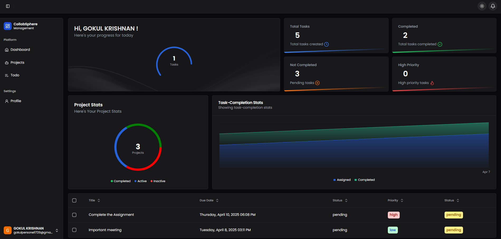
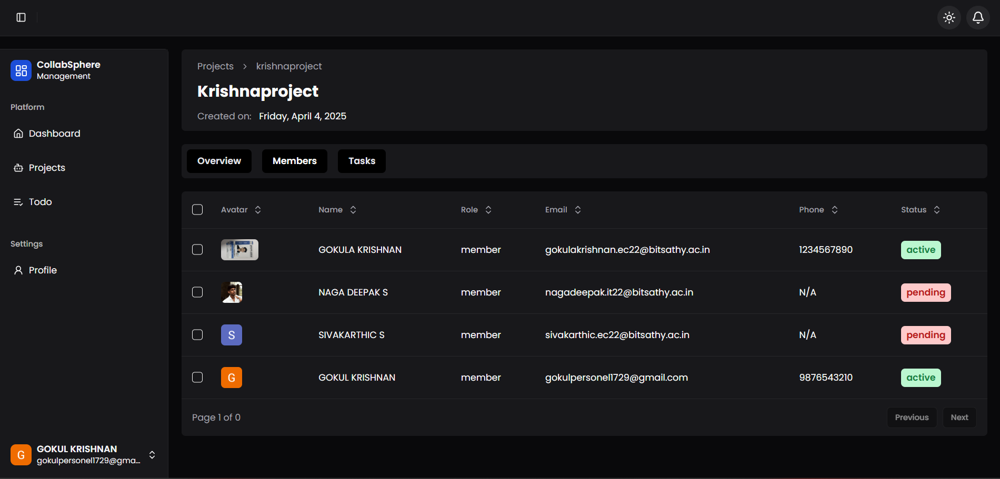
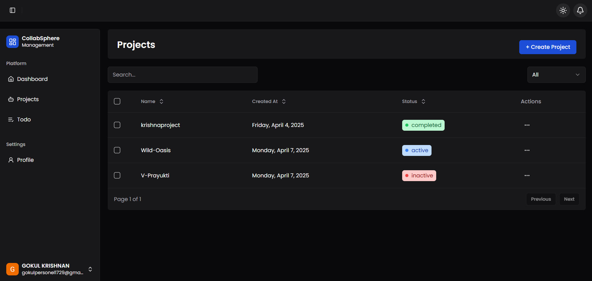

# 🚀 CollabSphere

**CollabSphere** is a full-stack project management platform built for teams to collaborate efficiently. Users can create projects, invite teammates, assign tasks, manage to-do lists, and receive basic notifications—all within a clean and intuitive UI.

---

## 📸 Screenshots

\



---

## ✨ Features

- 🔹 Create and manage projects
- 👥 Add teammates to collaborate on tasks
- ✅ Assign tasks with due dates and descriptions
- 📝 Personal and team-wide to-do lists
- 🔔 Simple notification system for updates
- 🔐 Secure authentication with NextAuth
- 📦 Upload and store files with Amazon S3

---

## 🧰 Tech Stack

| Technology       | Purpose                                         |
| ---------------- | ----------------------------------------------- |
| **Next.js**      | React framework for building the frontend       |
| **Tailwind CSS** | Utility-first styling for fast UI development   |
| **Shadcn/UI**    | Accessible and modern UI components             |
| **MongoDB**      | NoSQL database for storing users/projects/tasks |
| **React Query**  | Data fetching, caching, and syncing             |
| **NextAuth.js**  | Authentication and session management           |
| **Amazon S3**    | File and asset storage                          |

---

## 🚀 Live Demo

🌐 **Live Site:** [placeholder]\
📂 **GitHub Repo:** [placeholder]

---

## ⚖️ Installation

To run this project locally:

```bash
git clone https://github.com/yourusername/collabsphere.git
cd my-app
npm install
npm run dev
```

---

## ⚙️ Environment Variables

Create a `.env.local` file in the root directory and add the following:

```env
MONGODB_URI=your_mongodb_connection_string
NEXTAUTH_URL=http://localhost:3000
NEXTAUTH_SECRET=your_nextauth_secret

AWS_ACCESS_KEY_ID=your_aws_access_key
AWS_SECRET_ACCESS_KEY=your_aws_secret_key
AWS_BUCKET_NAME=your_bucket_name
AWS_REGION=your_region
```

---

## 🗃️ Folder Structure

```
/app            → Pages and routes (Next.js App Router)
/components     → Reusable UI components (Shadcn + Tailwind)
/lib            → Utility functions and config
/public         → Static assets
```

## 📄 License

This project is open-source and available under the [MIT License](LICENSE).

---

## 🙇‍♂️ Author

Created with 💻 by Gokulakrishnan

---

